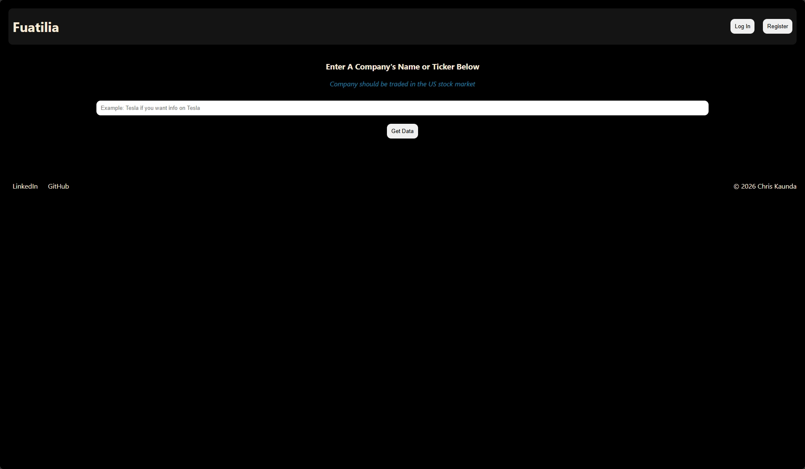
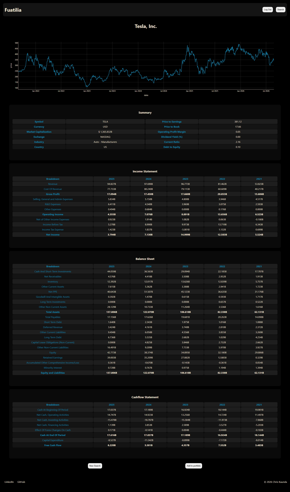
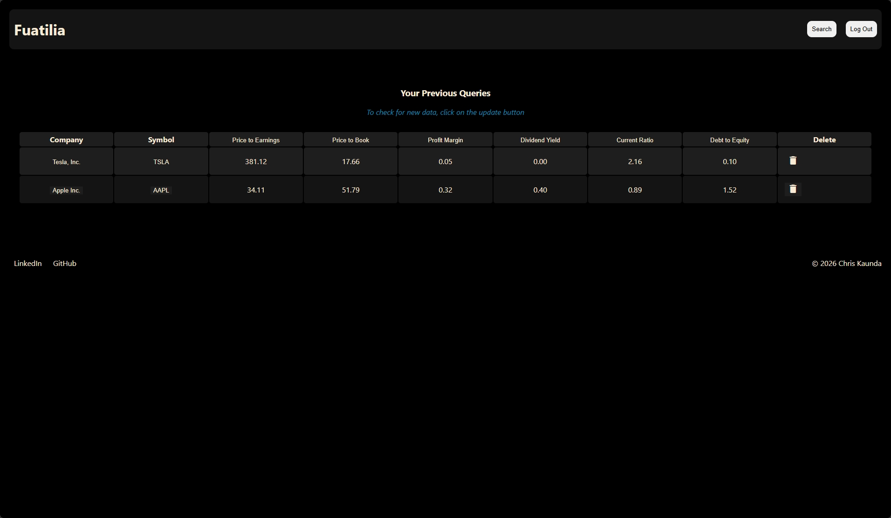

# Fuatilia

Fuatilia ("to track/follow" in Swahili) is a web app for looking up US-listed companies and reviewing their key financial statements — income statement, balance sheet, and cashflow statement — pulled live from [Financial Modeling Prep](https://financialmodelingprep.com/) (FMP). Registered users can save companies to a personal portfolio and sort them by financial ratios.

Built as a project to learn programming from the ground up, with a focus on connecting a finance background to real code.

---

## What it does

- **Search** for any US-listed company by name or ticker (NASDAQ, NYSE, AMEX)
- **View** a company's profile, price chart, and three core financial statements across multiple fiscal years
- **Register / log in** to keep a personal portfolio of companies
- **Sort** your portfolio by valuation and financial ratios (P/E, P/B, margin, dividend yield, current ratio, debt-to-equity)
- **Cache** financial statement data locally so repeat visits don't hit the API unnecessarily

---

## Screenshots

**Search**


**Company page** — profile, price chart, and financial statements


**Portfolio** — saved companies with sortable ratios


---

## Tech stack

| Layer | Tool |
|---|---|
| Backend | Python, Flask |
| Templates | Jinja2 |
| Database | SQLite |
| Data source | Financial Modeling Prep API |
| Charts | Plotly |
| Auth | bcrypt (password hashing), Flask sessions |

---

## Project structure

```
fuatilia/
├── app.py              # Flask routes — registration, login, search, company pages, portfolio
├── stock_data.py        # StockData class — talks to the FMP API, builds and caches statement data
├── helpers.py            # Database connection, schema setup, auth helpers, portfolio storage
├── templates/
│   ├── base.html          # Shared page shell (header block, main block, footer)
│   ├── index.html         # Search landing page
│   ├── search.html        # Search results
│   ├── company.html       # Company profile + financial statements
│   ├── login.html / register.html / reset.html
│   └── portfolio.html     # Saved companies, sortable
└── static/
    ├── index.css           # Single stylesheet for the whole app
    └── images/               # Screenshots used in this README
```

---

## Running it locally

1. Clone the repo and install dependencies:
   ```
   pip install -r requirements.txt
   ```
2. Create a `.env` file in the project root with:
   ```
   API_KEY=your_fmp_api_key
   SECRET_KEY=your_flask_secret_key
   ```
3. Run the app:
   ```
   python app.py
   ```
4. The database (`fuatilia.db`) is created automatically on first run.

---

## Acknowledgements

Financial data provided by [Financial Modeling Prep](https://financialmodelingprep.com/).
