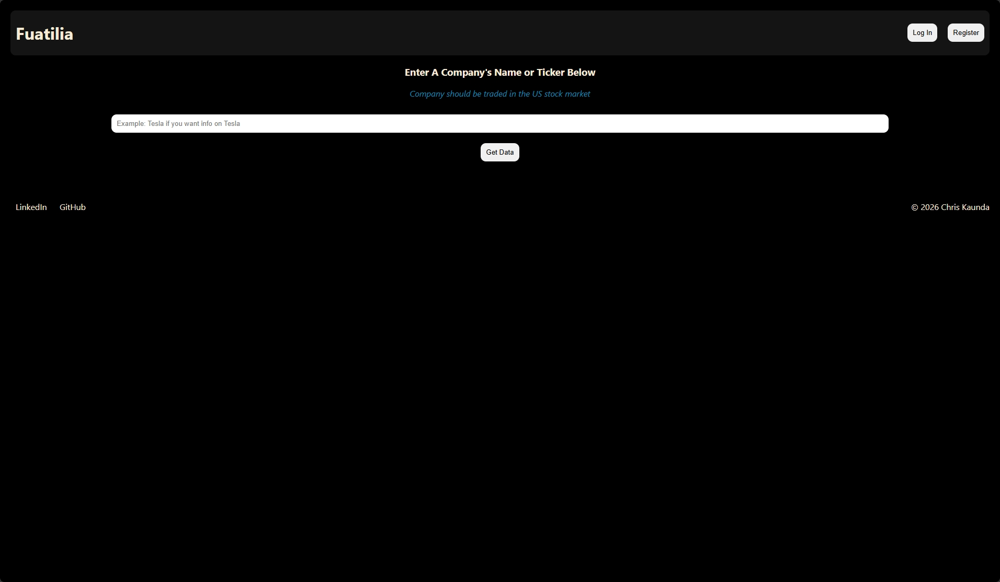
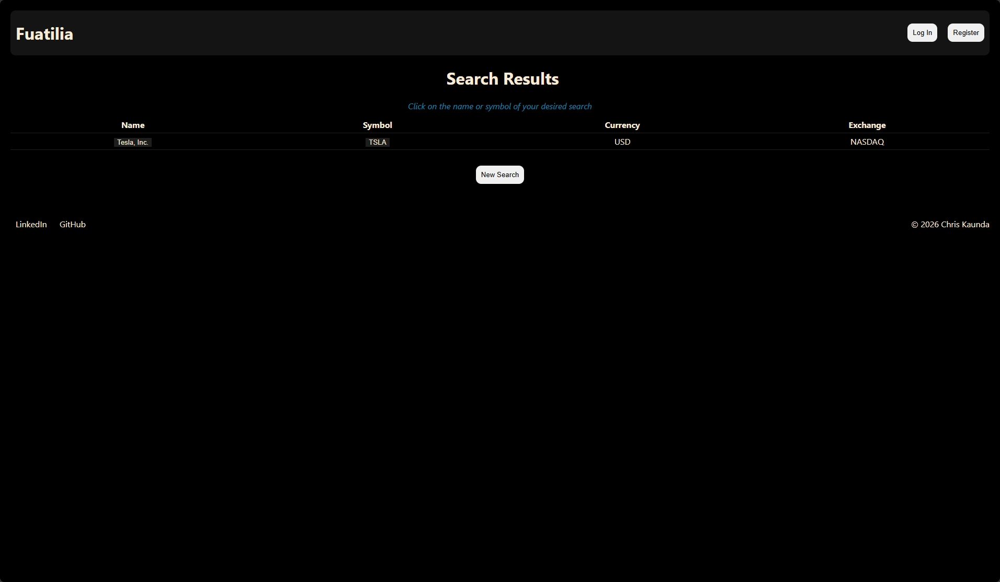
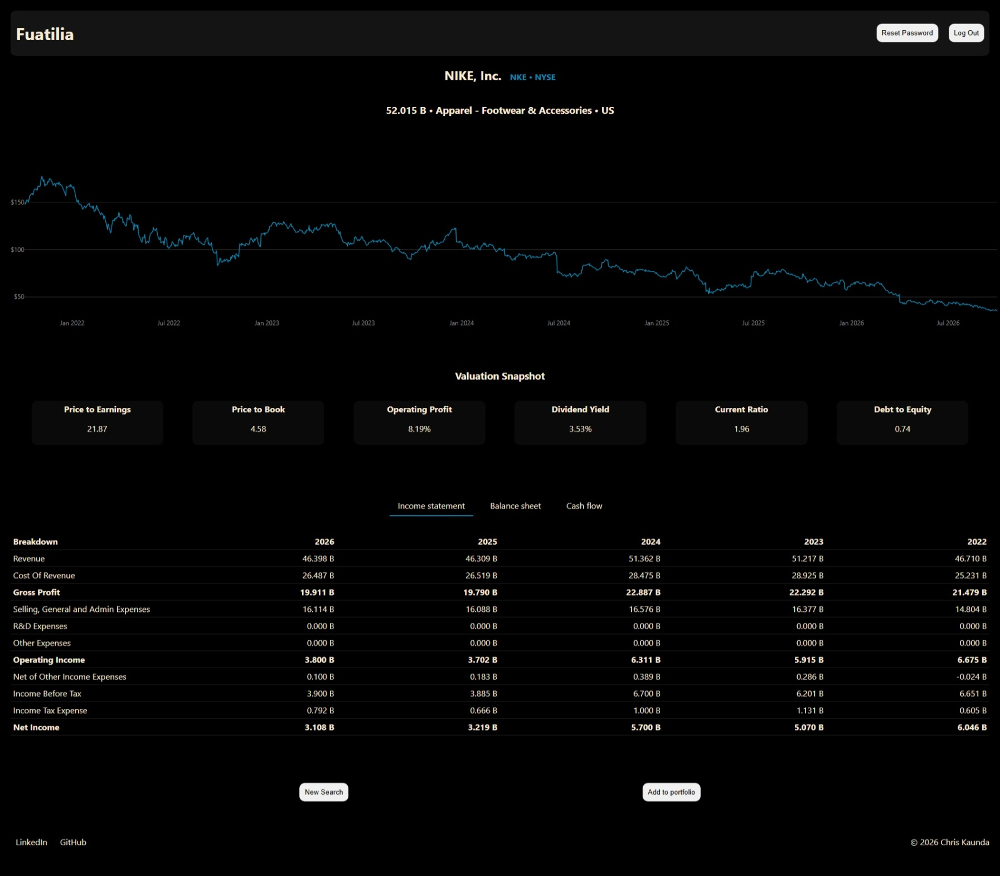
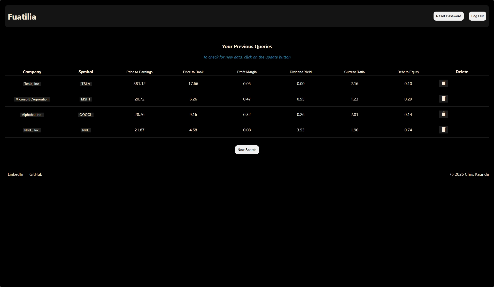

# Fuatilia

Fuatilia ("to track/follow" in Swahili) is a web app for looking up US-listed companies and reviewing their key financial statements (income statement, balance sheet and cash flow statement), pulled live from [Financial Modeling Prep](https://financialmodelingprep.com/) (FMP). Registered users can save companies to a personal portfolio and sort them by financial ratios.

It was built as a project to learn programming from the ground up, with a focus on connecting a finance background to real code.

**Live demo:** https://www.fuatilia.com/

> Fuatilia displays data from a third-party API for learning and research purposes. It is not financial advice.

---

## Features

- **Search** for any US-listed company by name or ticker (NASDAQ, NYSE, AMEX).
- **View** a company's profile, price chart, and three core financial statements across multiple fiscal years.
- **Register and log in** to keep a personal portfolio of companies. Passwords must be at least 6 characters and contain at least one letter and one number.
- **Save a search from before you sign up.** If you look at a company while logged out, it is added to your portfolio when you register or log in.
- **Sort** your portfolio by valuation and financial ratios (P/E, P/B, operating profit margin, dividend yield, current ratio, debt-to-equity). Clicking a column header sorts ascending, and clicking again toggles to descending.
- **Delete** companies from your portfolio.
- **Reset your password** and **log out** from the portfolio page.
- **Failed-login lockout.** After two failed attempts, the login form is disabled and asks the user to contact support.
- **Cache** data locally so repeat visits don't use up API calls (see [How it works](#how-it-works)).

---

## Screenshots

**Search**


**Search**


**Company page**: profile, price chart, and financial statements


**Portfolio**: saved companies with sortable ratios


---

## Tech stack

| Layer | Tool |
|---|---|
| Backend | Python, Flask, served with Gunicorn in production |
| Templates | Jinja2 |
| Database | SQLite (`sqlite3` from the standard library) |
| Data source | Financial Modeling Prep API, called with `requests` |
| Data handling | pandas |
| Charts | Plotly (loaded from a CDN, so charts need an internet connection) |
| Auth | bcrypt for password hashing, Flask signed-cookie sessions |
| Config | python-dotenv |

---

## How it works

### Request flow

1. The user searches by name. `StockData.search()` queries FMP and keeps only results on US exchanges, removing duplicate symbols.
2. The user picks a company. `StockData.package_data()` gathers the profile, price history, income statement, balance sheet, cash flow statement and ratios.
3. The data is stored in SQLite, and the page is rendered with the statements and a Plotly price chart.
4. If the user is logged in and saves the company, a row is written to their portfolio containing the six headline ratios.

### Caching

Different data goes stale at different speeds, so it is refreshed on different schedules:

| Data | Refetched from the API when |
|---|---|
| Company profile and price history | It has not been fetched today |
| Income statement, balance sheet, cash flow, ratios | The stored statement date is more than a year old, or nothing is stored |

Within those windows, pages are served from the local database. This matters because the API plan has a daily call limit (see [Known limitations](#known-limitations)). A company page that needs a full refresh uses up to six API calls: two for profile and price, and four for statements and ratios. These calls run concurrently with a thread pool.

### Portfolio ratios are a snapshot

The ratios in a user's portfolio are copied from the ratios table at the moment the company is saved, so they reflect the data as it was then, not live values. Saving the same company again replaces the old row with fresh values.

### Database

SQLite with these tables: `users`, `companies` (profile, price data and refresh dates), `portfolios` (one row per user and company), and one table each for `income_statements`, `balance_sheets`, `cashflows` and `ratios` (stored as JSON keyed by company). The schema is created automatically on first run.

---

## Design decisions

- **Passwords are hashed with bcrypt** using a per-password salt, and plaintext passwords are never stored. Login errors say "Invalid username or password" whether the username or the password was wrong, so they don't reveal which usernames exist.
- **All queries use parameters**, never string-built SQL for user values.
- **The sort column and order are whitelisted.** `ORDER BY` can't take a bound parameter, so the column and direction are checked against fixed lists before being placed in the query. Anything else falls back to the default.
- **Duplicates are prevented at the database level.** `UNIQUE(user_id, company_id)` on the portfolio table guarantees a user can't hold the same company twice, whatever the application code does.
- **Session cookies** are signed, set to `SameSite=Lax`, and marked `Secure` unless the app runs in debug mode.
- **Secrets come from the environment**, not from the code. `SECRET_KEY` and `API_KEY` live in `.env`, which is not committed.
- **Dates are validated and normalised** to ISO format before being stored, so every row is in the same format and date comparisons work on the text column.
- **API failures degrade gracefully.** If an endpoint returns nothing, the app stores what it has and shows an on-page message instead of crashing.

---

## Project structure

```
fuatilia/
├── app.py               # Flask routes: register, login, reset, logout, search, company, portfolio, sort, delete
├── stock_data.py        # StockData class: calls the FMP API, builds the price chart, handles caching
├── helpers.py           # Database connection, schema setup, password check, portfolio storage, refresh checks
├── requirements.txt     # Pinned dependencies
├── .env.example         # Template for the environment variables
├── templates/
│   ├── base.html        # Shared page shell (header block, main block, footer)
│   ├── index.html       # Search landing page
│   ├── search.html      # Search results
│   ├── company.html     # Company profile and financial statements
│   ├── login.html / register.html / reset.html
│   └── portfolio.html   # Saved companies, sortable
└── static/
    ├── index.css        # Single stylesheet for the whole app
    └── images/          # Screenshots used in this README
```

`fuatilia.db` is created on first run and is not committed.

---

## Getting started

### Prerequisites

- Python 3.14 (developed and tested on 3.14.7). [MIN_PYTHON: 3.14]
- A free API key from [Financial Modeling Prep](https://financialmodelingprep.com/).

### Install

1. Clone the repo and enter the folder.
2. Create and activate a virtual environment:
   ```
   python -m venv .venv
   .venv\Scripts\activate          # Windows
   source .venv/bin/activate       # macOS / Linux
   ```
3. Install the dependencies:
   ```
   pip install -r requirements.txt
   ```
4. Copy `.env.example` to `.env` and fill it in (see below).
5. Run the app:
   ```
   python app.py
   ```
6. Open http://127.0.0.1:5000 in your browser. The database is created automatically on first run.

### Environment variables

| Variable | Required | Purpose |
|---|---|---|
| `API_KEY` | Yes | Your Financial Modeling Prep API key |
| `SECRET_KEY` | Yes | Secret used to sign session cookies. Generate one with `python -c "import secrets; print(secrets.token_hex(32))"` |
| `FLASK_DEBUG` | Local only | Set to `1` when running locally. The app only marks its session cookie `Secure` when this is not `1`, and some browsers reject Secure cookies over plain `http://`, which would stop you staying logged in. **Never set this in production.** |
| `DB_PATH` | No | Path to the SQLite file. Defaults to `fuatilia.db` next to the code |

Example `.env` for local development:

```
API_KEY=your_fmp_api_key
SECRET_KEY=your_generated_secret_key
FLASK_DEBUG=1
```

---

## Deployment

The app is hosted on [Render](https://render.com/) and served with Gunicorn (for example, start command `gunicorn app:app`).

- **Persistent storage.** SQLite is a file, and Render's default filesystem is wiped on each deploy. Attach a persistent disk and point `DB_PATH` at a location on it, otherwise users and portfolios are lost on redeploy.
- **Set the environment variables** `API_KEY` and `SECRET_KEY` in the Render dashboard. Leave `FLASK_DEBUG` unset.
- **Pin the Python version.** Render picks its own Python unless told otherwise. Set the `PYTHON_VERSION` environment variable (or use a `.python-version` file) to match the version you develop on.
- Dependencies are installed from `requirements.txt`, so test upgrades locally before pushing.

---

## Known limitations

- **API call limit.** The FMP plan in use allows 250 calls a day, and a fully fresh company page can use up to six. Caching reduces this, but many new companies in one day could exhaust it.
- **Restricted symbols.** Some symbols aren't available on the current API plan. These show an on-page message and are not retried or rate-limited yet.
- **US exchanges only** (NASDAQ, NYSE, AMEX).
- **No live refresh of portfolio ratios.** They are a snapshot from when a company was saved, and the portfolio table has no refresh control yet.
- **Login lockout is stored in the session cookie.** It slows down casual guessing, but it is not real brute-force protection, because clearing cookies resets it. Rate limiting by IP or account would be the proper fix.
- **No CSRF tokens on forms.** `SameSite=Lax` on the session cookie gives partial protection, but token-based protection (for example, Flask-WTF) is not implemented.
- **Sorting is a POST that re-renders the page**, and the ASC/DESC direction is a single flag per session rather than per column.
- **SQLite** suits a small app with few concurrent users. A larger user base would call for a server database such as PostgreSQL.

---

## Acknowledgements

Financial data provided by [Financial Modeling Prep](https://financialmodelingprep.com/).
